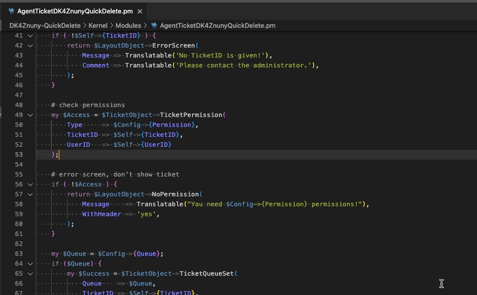
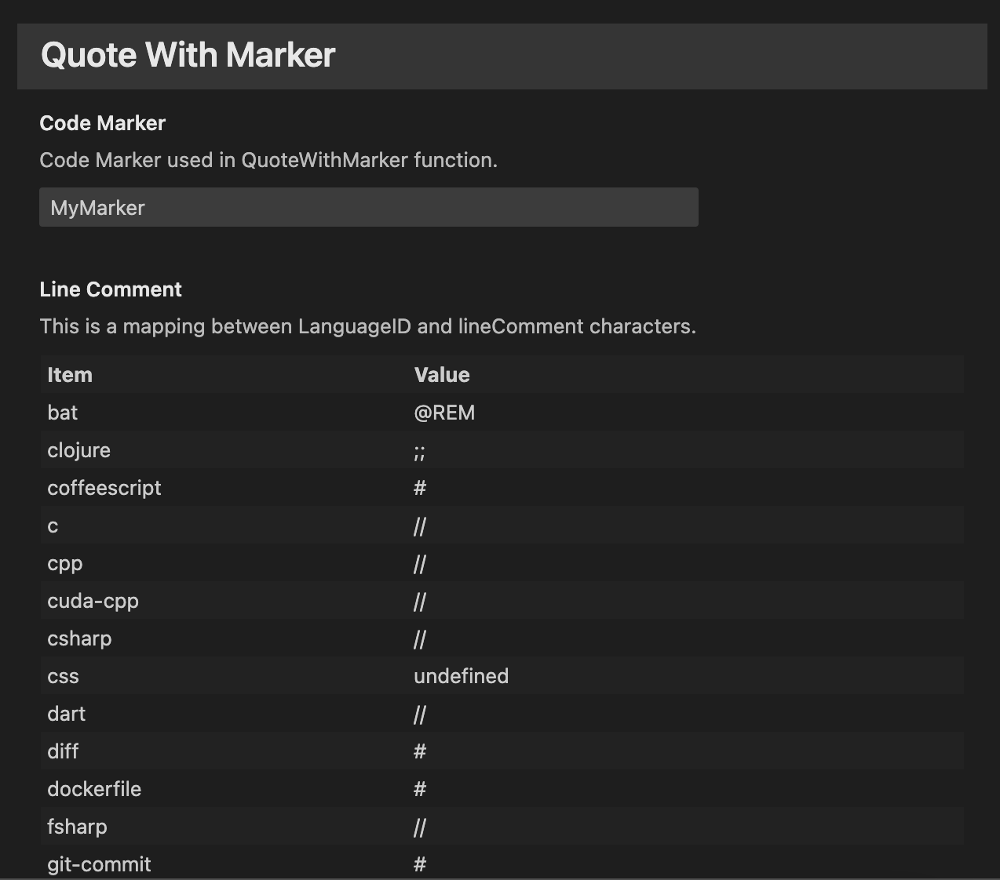

# QuoteWithMarker

**QuoteWithMarker** is an extension that quotes the selected area and adds a custom marker to it.

| Repository | GitHub | Visual Studio Marketplace |
| ------ | ------ | ------ |
|  |   |   |
|  |   |  |
|   |  |   |
|   |  |   |

| Status |
 | ------ |
| [](https://github.com/dennykorsukewitz/VSCode-QuoteWithMarker/compare/1.1.1...dev)   |

## Feature

Sometimes you have to mark and comment code. Here is the QuoteWithMarker very helpful.
This function quotes the selected area and adds a custom marker to it.
This way you can still trace the original code.
There is also a start and end block for better display when merging.

`QuoteWithMarker` can be very useful especially for patch files.

**Shortcut:** ```strg + alt + k, q```<br>
**Command:**  ```QuoteWithMarker: Quote with Marker.```

<details>
  <summary>Works for the following languages:</summary>

| LanguageID              | LineComment |
| ----------------------- | ----------- |
| bat                     | @REM        |
| clojure                 | ;;          |
| coffeescript            | #           |
| c                       | //          |
| cpp                     | //          |
| cuda-cpp                | //          |
| csharp                  | //          |
| CSS                     |             |
| dart                    | //          |
| diff                    | #           |
| dockerfile              | #           |
| fsharp                  | //          |
| git-commit              | #           |
| git-rebase              | #           |
| ignore                  | #           |
| go                      | //          |
| groovy                  | //          |
| handlebars              |             |
| hlsl                    | //          |
| HTML                    |             |
| ini                     | ;           |
| plaintext               | #           |
| java                    | //          |
| javascriptreact         | //          |
| JavaScript              | //          |
| jsx-tags                |             |
| json                    | //          |
| jsonc                   | //          |
| jsonl                   | //          |
| julia                   | #           |
| tex                     | %           |
| latex                   | %           |
| cpp_embedded_latex      | //          |
| markdown_latex_combined |             |
| less                    | //          |
| lua                     | --          |
| makefile                | #           |
| Markdown                |             |
| objective-c             | //          |
| objective-cpp           | //          |
| perl                    | #           |
| perl6                   | #           |
| php                     | //          |
| powershell              | #           |
| jade                    | //-         |
| python                  | #           |
| r                       | #           |
| razor                   |             |
| restructuredtext        | ..          |
| ruby                    | #           |
| rust                    | //          |
| SCSS                    | //          |
| shaderlab               | //          |
| shellscript             | #           |
| sql                     | --          |
| swift                   | //          |
| TypeScript              | //          |
| typescriptreact         | //          |
| vb                      | '           |
| xml                     |             |
| xsl                     |             |
| dockercompose           | #           |
| yaml                    | #           |

</details>

<br>



### Settings

`Preferences -> Settings -> Extensions -> QuoteWithMarker`

| Name | Description | Default Value |
| - | - | - |
| quoteWithMarker.codeMarker | Code Marker used in QuoteWithMarker function. | MyMarker |
| quoteWithMarker.lineComment | This is a mapping between LanguageID and lineComment characters. | All possible lineComment's |



---

## Installation

To install this extension, you have **three** options:

### 1. Search Extension in Marketplace

Search and install online extension via VSC extensions menu.

`Code` -> `Preferences` -> `Extensions` simply search for `QuoteWithMarker` to install.

### 2. Install via vsix file

Download latest [vsix file](https://github.com/dennykorsukewitz/VSCode-QuoteWithMarker/releases) and install via extensions menu.

`Code` -> `Preferences` -> `Extensions` -> `Views and More Action` -> `Install from VSIX`.

### 3. Source code

Download archive with the latest [release](https://github.com/dennykorsukewitz/VSCode-QuoteWithMarker/releases) and unpack it to VisualStudioCode extensions folder
`$HOME/.vscode/extensions/`.

---

## Download

For download see [VSCode-QuoteWithMarker](https://github.com/dennykorsukewitz/VSCode-QuoteWithMarker/releases)

---

Enjoy!

Your [Denny Korsukéwitz](https://github.com/dennykorsukewitz) 🚀
